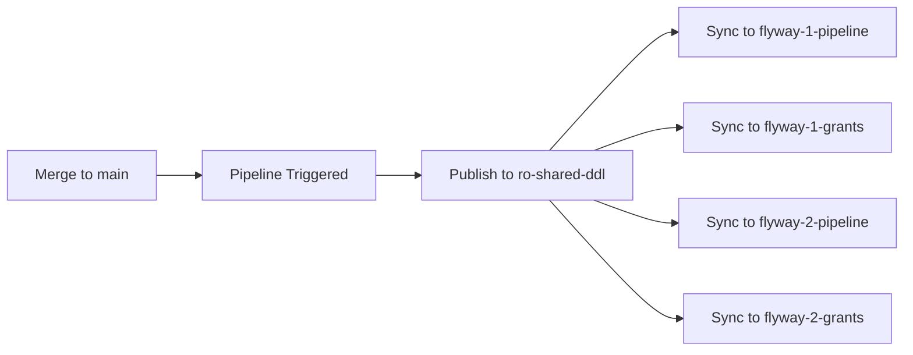

# 🚀 How The Flyway Distributed Architecture Works

## 📋 Quick Start - Normal Usage

### 🎯 The Simple Workflow

1. **Add your files to the parent repository** (`shared-flyway-ddl`)
2. **Merge to `main` branch** 
3. **Pipeline automatically syncs to all child repositories**
4. **Child repositories get the updated DDL files**

---

## 📁 Step-by-Step Guide

### 1. **Add New Files** (You are here - `dev` branch)

Add your Flyway files to the appropriate folders in `read-write-flyway-files/`:

```bash
# Navigate to the shared repository
cd shared-flyway-ddl

# Switch to dev branch (if not already)
git switch dev

# Add your new migration files
echo "CREATE TABLE new_feature ..." > read-write-flyway-files/sql/V7__add_new_feature.sql

# Add callbacks if needed
echo "-- After migration callback" > read-write-flyway-files/callbacks/afterMigrate_feature.sql

# Add configuration changes
echo "flyway.schemas=public,feature" > read-write-flyway-files/global_config/feature.conf
```

### 2. **Commit and Push to Dev**

```bash
# Commit your changes
git add read-write-flyway-files/
git commit -m "feat: add new feature migration V7 with callbacks"

# Push to dev branch
git push origin dev
```

### 3. **Create Pull Request** (Dev → Main)

- Go to GitHub and create a PR from `dev` to `main`
- Get code review approval
- Merge the PR

### 4. **Automatic Deployment Pipeline** ✨

When you merge to `main`, the pipeline automatically:



**What happens automatically:**
1. 📤 **Publishes** your `read-write-flyway-files/` to the `ro-shared-ddl` branch
2. 🔄 **Syncs** all 4 child repositories with the new files
3. 📁 **Updates** each child's `read-only-flyway-files/` folder
4. ✅ **Commits** and pushes changes to child repositories
5. 🔔 **Notifies** you of sync status

---

## 🎯 What Gets Deployed

### **Files That Sync to Children:**
```
read-write-flyway-files/
├── sql/                    → All SQL migrations
├── callbacks/              → All Flyway callbacks  
├── global_config/          → Shared configuration
├── scripts/               → Utility scripts
└── yaml/                  → YAML configurations
```

### **Files That Stay in Parent Only:**
```
docs/                      → Documentation
repo-tools/                → Management scripts
README.md                  → Repository info
```

---

## ⚡ Manual Sync (If Needed)

If you need to sync manually (rare):

```bash
# From the parent repository
./repo-tools/unified_flyway_sync.sh full --auto-commit

# Or just check status
./repo-tools/unified_flyway_sync.sh status
```

---

## 🔍 Verification

After deployment, verify sync worked:

```bash
# Check all repositories are synchronized
./repo-tools/unified_flyway_sync.sh status

# Should show: ✅ ALL REPOSITORIES IN SYNC
```

**Or check individual child repositories:**
```bash
cd ../flyway-1-pipeline
ls read-only-flyway-files/sql/  # Should see your new V7 file
```

---

## 🛡️ Protection Features

The system prevents accidents:
- ❌ **Can't modify** `read-only-flyway-files/` in child repos directly
- ❌ **Can't force push** or delete branches  
- ❌ **Can't merge** without code review
- ✅ **Only the parent** can update shared DDL files
- ✅ **Automation** bypasses restrictions for sync operations

---

## 🚨 If Something Goes Wrong

### **Sync Failed?**
```bash
# Try manual sync
./repo-tools/unified_flyway_sync.sh full --auto-commit

# Nuclear option (destructive - use carefully)
./repo-tools/unified_flyway_sync.sh nuclear --force-nuclear
```

### **Child Repository Issues?**
```bash
# Check GitHub Actions logs in parent repository
# Or run status check
./repo-tools/unified_flyway_sync.sh status
```

### **Need to Rollback?**
- Revert the commit in parent `main` branch
- Pipeline will automatically sync the rollback

---

## 🎉 That's It!

**Normal workflow:**
1. Add files to `read-write-flyway-files/` on `dev` branch
2. PR to `main` → get approval → merge
3. Pipeline automatically deploys to all child repositories
4. Your DDL is now available in all 4 Flyway projects!

The system handles all the complexity of keeping 4 repositories synchronized while maintaining proper Git history and protection against accidents.