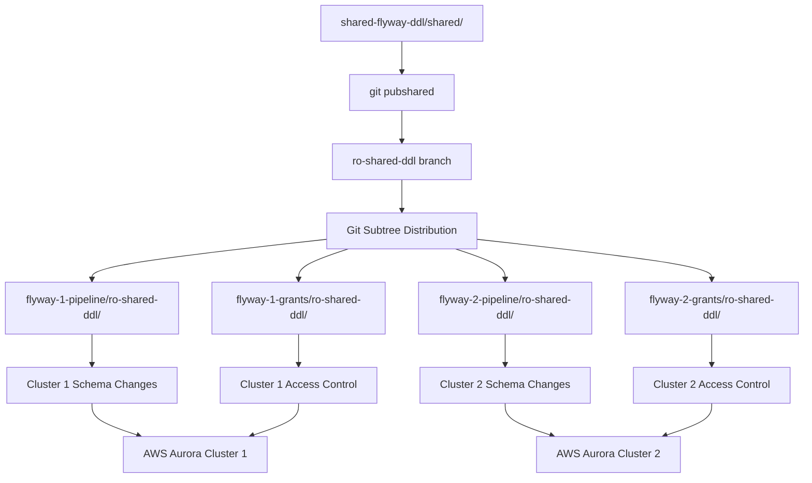

# 🛠️ Flyway Distributed Repository Strategy

## 📋 Project Overview

This project is a **learning laboratory** for exploring distributed Git repository strategies specifically designed for **Flyway database migration management**. The primary goal is to experiment with different approaches to connecting and synchronizing Git repositories using a parent-child architecture with Git subtrees.

**Current Status**: Repository structure and synchronization complete ✅  
**Next Phase**: AWS Aurora integration and CI/CD pipeline development  
**Learning Focus**: Git subtree strategies, branch management, and distributed Flyway DDL governance  

---

## 🎯 Learning Objectives

- **Experiment with Git subtree** parent-child repository relationships
- **Practice distributed Flyway DDL management** across multiple database clusters
- **Develop branch strategies** for different deployment environments
- **Create automated synchronization tools** for maintaining consistency
- **Prepare infrastructure** for AWS Aurora PostgreSQL integration

---

## 🏗️ Architecture Overview

### Repository Structure
```
Flyway-Repo-Structure/                    # 🎓 Learning workspace
├── shared-flyway-ddl/                    # 🏗️ PARENT - Central DDL governance
│   ├── README.md                         # Entry-point documentation
│   ├── docs/                             # Deep dives, diagrams, runbooks
│   ├── read-write-flyway-files/          # Source-of-truth migrations
│   │   ├── sql/                          # Baseline + experimental migrations
│   │   ├── yaml/                         # Config + manifest templates
│   │   ├── callbacks/                    # Flyway callback scripts
│   │   ├── scripts/                      # Helper SQL/PSQL utilities
│   │   └── global_config/                # Shared Flyway configuration
│   └── repo-tools/                       # Automation + governance helpers
│       ├── unified_flyway_sync.sh        # Parent→child distributor (VS Code task)
│       ├── setup-child-protection.sh     # Ruleset/bootstrap helper
│       ├── security-audit.sh             # Guardrail scanner
│       └── rulesets/                     # JSON rules consumed by children
│
├── flyway-1-pipeline/                    # 🏗️ Cluster 1 - Schema DDL
│   ├── .github/workflows/                # Landing confirmation & protections
│   ├── config/                           # Branch ruleset JSON + metadata
│   └── read-only-flyway-files/           # Synced parent payload (READ-ONLY)
│
├── flyway-1-grants/                      # 🔐 Cluster 1 - Access control
│   ├── .github/workflows/                # Grants-specific checks/badges
│   ├── config/                           # Grants rulesets + metadata
│   └── read-only-flyway-files/           # Shared DDL snapshot (READ-ONLY)
│
├── flyway-2-pipeline/                    # 🏗️ Cluster 2 - Schema DDL
│   ├── .github/workflows/                # Cluster 2 landing confirmation
│   ├── config/                           # Protection configs
│   └── read-only-flyway-files/           # Synced parent payload
│
└── flyway-2-grants/                      # 🔐 Cluster 2 - Access control
    ├── .github/workflows/                # Cluster 2 grants guardrails
    ├── config/                           # Branch rules + metadata
    └── read-only-flyway-files/           # Shared DDL snapshot (READ-ONLY)
```

### Data Flow


---

## 🌳 Branch Strategy & Environment Management

### Repository Branch Architecture

Each repository uses a **three-tier branch strategy** aligned with deployment environments:

| Branch | Environment | Purpose | Protection Level | AWS Target |
|--------|-------------|---------|------------------|------------|
| **`dev`** | Development | Experimentation, local testing | None | Local/Dev DB |
| **`main`** | Staging | Integration testing, UAT | Moderate | Staging Aurora |
| **`master`** | Production | Battle-tested, stable releases | High | Production Aurora |

### Parent Repository Branch Strategy

**`shared-flyway-ddl` Branch Structure:**
- **`main`**: Production-ready shared content
- **`dev`**: Experimental shared templates and utilities
- **`ro-shared-ddl`**: Delivery branch for production (from `main`)
- **`ro-shared-ddl-dev`**: Delivery branch for development (from `dev`)
- **`ro-shared-ddl-staging`**: Delivery branch for staging environments

### Branch-Specific Synchronization

```bash
# Sync production content to master branches
./validate_children_ro_shared.sh --fix --child-branch master --parent-branch ro-shared-ddl

# Sync staging content to main branches
./validate_children_ro_shared.sh --fix --child-branch main --parent-branch ro-shared-ddl

# Sync experimental content to dev branches  
./validate_children_ro_shared.sh --fix --child-branch dev --parent-branch ro-shared-ddl-dev
```

---

## 🚨 Nuclear Subtree Sync

### Overview
The **Nuclear Subtree Sync** is an emergency recovery tool that completely rebuilds all Git subtree relationships from scratch. It operates on **all branches** and provides a "last resort" option when normal synchronization fails.

### How It Works
1. **Stashes** any uncommitted changes in child repositories
2. **Completely removes** existing `ro-shared-ddl/` folders
3. **Fetches latest** parent delivery branches
4. **Rebuilds subtrees** from scratch using `git subtree add`
5. **Verifies synchronization** with directory comparison
6. **Reinstalls Git hooks** automatically
7. **Pushes updates** to all remote repositories

### When to Use
- **Corrupted subtree relationships** (nested folder issues)
- **Failed normal sync operations**
- **Repository structure corruption**
- **Complete environment reset needed**

### Usage
```bash
# WARNING: This will overwrite any local changes in ro-shared-ddl folders
./nuclear_subtree_sync.sh

# Type 'NUCLEAR' to confirm the operation
```

### Safety Features
- **Confirmation prompt** prevents accidental execution
- **Automatic stashing** preserves local work
- **Directory verification** confirms successful sync
- **Hook reinstallation** restores protection mechanisms

---

## 🔧 Git Subtree Learning Experiments

This project serves as a testing ground for various Git subtree strategies:

### Current Implementation: **Read-Only Subtree Distribution**
- **Parent** contains source of truth in `shared/` directory
- **Children** receive read-only copies in `ro-shared-ddl/` folders
- **Synchronization** is unidirectional (parent → children)
- **Protection** via Git hooks prevents accidental edits

### Protection Mechanisms
- **Visual markers**: `.DO_NOT_EDIT_MANAGED_BY_PARENT` files
- **Git pre-commit hooks**: Warn before committing to managed folders
- **Branch-aware protection**: More lenient on `dev` branches
- **Documentation**: Clear README instructions in all repositories

### Synchronization Tools
- **`validate_children_ro_shared.sh`**: Validates and syncs all children
- **`git syncshared` alias**: Individual repository sync
- **`git pubshared` alias**: Parent content publishing
- **`nuclear_subtree_sync.sh`**: Emergency recovery tool

---

## 🏗️ Repository Types & Responsibilities

### Parent Repository: `shared-flyway-ddl`
**Purpose**: Centralized governance and shared resource management  
**Content**: 
- Baseline database schemas
- Common migration templates  
- Shared utility scripts
- Git hooks and automation tools
- Documentation and standards

### Pipeline Repositories: `flyway-*-pipeline`
**Purpose**: Schema-level DDL management for specific clusters  
**Content**:
- Versioned migrations (`V__` prefix)
- Structural database changes (tables, views, functions, indexes)
- Cluster-specific schema modifications
- Database deployment configurations

### Grants Repositories: `flyway-*-grants`  
**Purpose**: Access control and permission management  
**Content**:
- Repeatable migrations (`R__` prefix)
- Role definitions and assignments
- Permission grants and revocations
- Security policy implementations

---

## 🚀 Getting Started

### Initial Setup
1. **Clone the workspace**:
   ```bash
   git clone <workspace-url> Flyway-Repo-Structure
   cd Flyway-Repo-Structure
   ```

2. **Install Git hooks in all repositories**:
   ```bash
   ./shared-flyway-ddl/shared/sh/setup_git_hooks.sh
   ```

3. **Verify synchronization**:
   ```bash
   cd shared-flyway-ddl
   ./validate_children_ro_shared.sh
   ```

### Daily Workflow

**Making Shared Changes:**
1. Edit files in `shared-flyway-ddl/shared/`
2. Commit and push changes
3. Publish to delivery branch: `git pubshared`
4. Sync to all children: `./validate_children_ro_shared.sh --fix --auto-commit`

**Making Cluster-Specific Changes:**
1. Work in individual `flyway-*` repositories
2. Edit files outside of `ro-shared-ddl/` folders
3. Normal Git workflow for local changes

---

## 🔮 Future Development Plans

### Phase 1: Current ✅
- [x] Repository structure design
- [x] Git subtree synchronization
- [x] Branch strategy implementation  
- [x] Automation tooling
- [x] Protection mechanisms

### Phase 2: AWS Integration 🔄
- [ ] AWS Aurora PostgreSQL cluster setup
- [ ] Flyway CLI configuration for multiple environments
- [ ] Database connection string management
- [ ] Environment-specific migration execution

### Phase 3: CI/CD Pipeline 📋
- [ ] GitHub Actions workflow creation
- [ ] Automated testing and validation
- [ ] Deployment automation to AWS Aurora
- [ ] Rollback and disaster recovery procedures

### Phase 4: Advanced Features 🎯
- [ ] Migration conflict detection
- [ ] Cross-cluster dependency management
- [ ] Automated schema drift detection
- [ ] Performance monitoring integration

---

## 📚 Learning Resources

### Git Subtree Documentation
- [Git Subtree Official Docs](https://git-scm.com/docs/git-subtree)
- [Atlassian Git Subtree Tutorial](https://www.atlassian.com/git/tutorials/git-subtree)

### Flyway Resources
- [Flyway Documentation](https://flywaydb.org/documentation/)
- [Flyway Best Practices](https://flywaydb.org/documentation/getstarted/firststeps/gradle)

### AWS Aurora Resources
- [Amazon Aurora Documentation](https://docs.aws.amazon.com/AmazonRDS/latest/AuroraUserGuide/)
- [Aurora PostgreSQL Migration Guide](https://docs.aws.amazon.com/AmazonRDS/latest/AuroraUserGuide/AuroraPostgreSQL.Migrating.html)

---

## 🤝 Contributing to the Learning Project

This is a learning environment designed for experimentation. Key learning areas:

1. **Git Strategy Experiments**: Try different subtree approaches
2. **Branch Management**: Test various branch protection strategies  
3. **Automation Enhancement**: Improve synchronization tools
4. **Documentation**: Document learnings and best practices

### Experimental Guidelines
- **`dev` branches**: Full experimentation freedom
- **`main` branches**: Tested changes only
- **`master` branches**: Production-ready changes only

---

## 📝 License

This learning project is for educational purposes and experimentation with distributed Git repository strategies for database migration management.

---

*Last updated: November 8, 2024*  
*Learning Focus: Git subtree strategies and Flyway DDL management*
